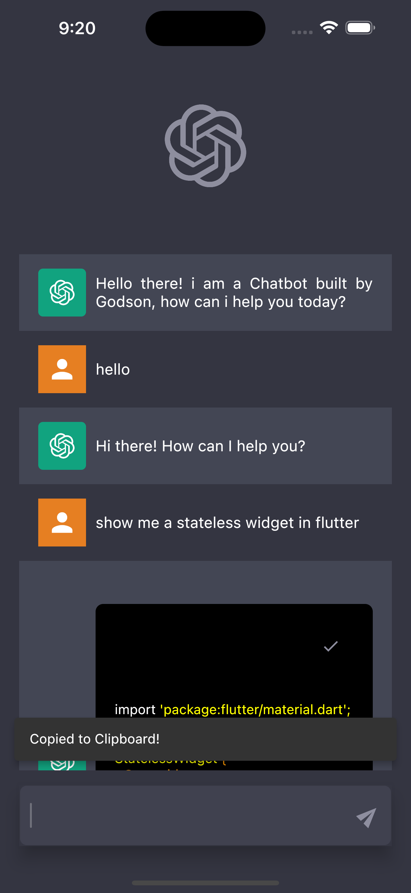
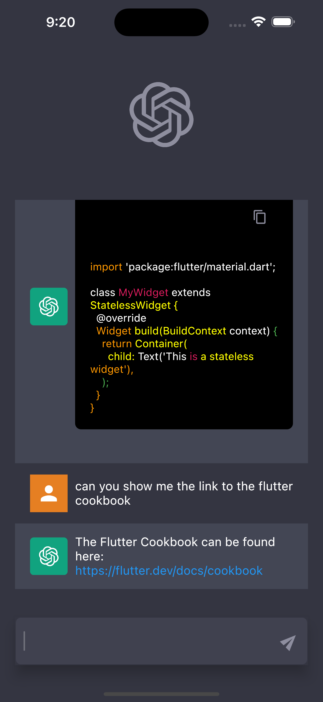
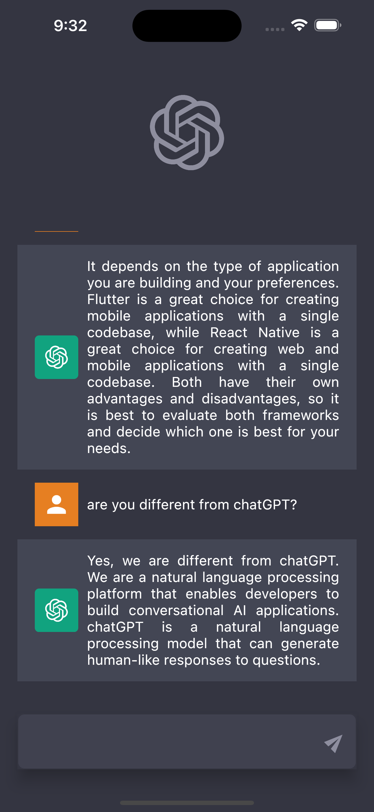
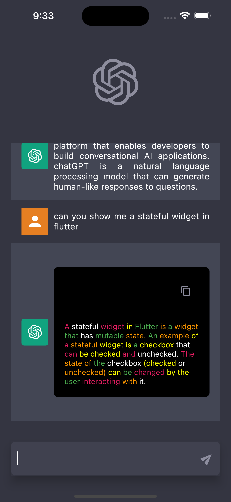

# ChatBot App

This is a a ChatBot that is highly inspired by chatGPT,
this ChatBot uses the OpenAI chat API to interact and provide solutions,
it customizes design based on the type of response(links, codes e.t.c),
it was built with the Riverpod state management solution

## Inspiration

The design inspiration is gotten from the chatGPT interface, 

## Screenshots

| Welcome | Chat  | 
|    :---:     |     :---:      |  
|    |    |

| Chat | Chat | 
|    :---:     |     :---:      |  
|    |    |

## Contributions

🎉 Feel free to contribute to this project.

If you find a bug or want a feature and don't know how to fix, implement or go about it, please fill an [issue](https://github.com/GreatGodson/ChatBot/issues) .

If you fixed a bug or implemented a feature, please send a [pull request](https://github.com/GreatGodson/ChatBot/pulls).

